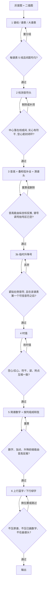

# 项目指南

这是「简谱标注器」项目：用 OpenCV 在五线谱图片上识别音符并叠印简谱数字。

## 关键文件

- `annotate.py` — 全部识别与渲染逻辑。入口是 `process_image`（Web）和 `run`（命令行）。
- `app.py` — FastAPI 服务：`/api/batch`（Web 批量）、`/api/annotate`（小程序单张上传）。
- `miniprogram/` — 微信小程序前端，调用 `/api/annotate`。
- `jev_annotate.py` — 可选。只在叠印阶段判断曲谱头是否跳过、数字放哪一侧。
- `debug/` — 各阶段调试图（`01_staffs.jpg`、`02_noteheads.jpg`、`04_durations.jpg`）。

数据结构：`Staff`（五线谱）、`System`（高音 + 低音大谱表）、`NoteHead`（音符头）、`ChordEvent`（同一列和弦）、`Page`（整页状态）。线距 `s` 是后面所有阈值的尺子。

## 流水线

上一阶段的结果必须过关，才进入下一步。不过关就停在本阶段修正。



| 阶段 | 代码 | 通过条件 | 不过关 |
| --- | --- | --- | --- |
| 1 谱表 | `detect_staff_lines` / `group_staves` / `pair_systems` | 5 条线、间距接近、上下谱能配成系统；线距 `s` 全页稳定 | 丢弃该谱表，不在上面找符头 |
| 2 符头 | `detect_noteheads`、`_is_real_notehead` | 中心对齐半个线距；实心附近有符干或梁；空心是音符大小的封闭白洞 | 删掉假符头；同一符干上有洞则补空心头 |
| 3 音高 | `detect_staff_clefs`、`assign_pitches`、`_recover_stacked_hollow_heads`、`purge_staff_header_noteheads` | `letter` / `octave` 与 `y` 及当前谱号一致；行首和正文谱号内没有符头 | 重算音高，或删掉谱号误检 |
| 3b 升降号 | `detect_accidentals`、`_clear_leading_accidentals` | 在第一个可信音符右侧，并且紧挨某个符头左边 | 行首调号整组忽略 |
| 4 时值 | `analyze_durations` | 全音符没有符干；有符干才计梁；附点右侧真有点 | 改 `beams` / `dotted`，不改音高 |
| 5 简谱 | `to_jianpu`、`build_chords` | `digit = letter % 7 + 1`，加点等于八度差，前缀等于 `alter`；同一列宽度不超过 `1.3 * s` | 重算数字；过宽的列拆开 |
| 6 叠印 | `render`；有 Key 时 `jev.decide_events` | 上行蓝字在上方，下行绿字在整条谱表下方；矩形在图内，不盖黑像素、不盖已画数字 | 在规定一侧逐列避让或缩字；曲谱头不画 |

形状过滤、行首清除、和弦宽度限制、叠印避让目前写在对应函数内部。Jev 只参与第 6 步，不回头核对音高和时值。

同一个实心墨迹核心只保留一个音符头，不能按候选坐标或半个线距将其拆成多个音符。相接和弦须有独立鼓包和收窄腰部，才允许按真实形状拆分。第 6 步以花括号大谱表为整体，上行蓝色、下行绿色，分别在上方和整条下谱表下方标注；颜色不随谱号变化。和弦整列排版，每头一个数字，不统一整行基线；规定一侧无空位时先缩小字号，仍放不下才跳过。

还缺一关：按小节把时值加总，核对是否等于拍号。代码没有检测小节线和拍号，漏符头、多符头、时值看错不会在中途被拦住。

## 运行

```bash
source .venv/bin/activate
python annotate.py <输入图片> [-o 输出] [--stage N] [--debug-dir debug]
```

调试图输出到 `debug/` 下，用于核对每个阶段。Web 服务是 `python app.py`，浏览器打开 `http://127.0.0.1:8000`。

## 注意事项

- 输出图片默认名为 `<输入名>_简谱标注.jpg`。
- `--stage N` 控制只运行到第 N 阶段（默认 6）。阶段 3 的调试图停在音符头（`02_noteheads.jpg`），阶段 4 出时值（`04_durations.jpg`）。
- 修改检测逻辑后，用 `debug/` 调试图核对，并跑 `python -m unittest tests.test_annotate`。
